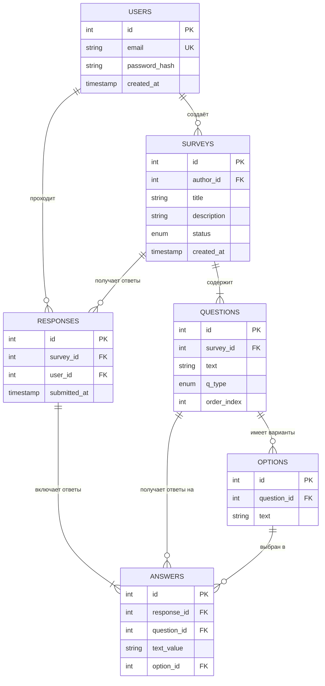

<<<<<<< HEAD
#  Смирнов.А.А Сервис Опросов 1ИСП-21
> **Survey Service** — Сервис опросов

В этом документе описано всё, что было выполнено в рамках первого чекпоинта проекта **Survey Service**.

---

##  Выполненные задачи

| № | Задача | Статус |
|---|--------|--------|
| 1 | Выбор стека технологий |  Выполнено |
| 2 | Инициализация проекта и Git-репозитория |  Выполнено |
| 3 | Проектирование ER-диаграммы базы данных |  Выполнено |
| 4 | Проектирование списка API эндпоинтов |  Выполнено |
| 5 | Создание и запуск миграций |  Выполнено |
| 6 | Написание README с описанием проекта |  Выполнено |

---

## 1.  Выбор стека технологий

Для реализации проекта был выбран следующий стек:

| Компонент | Технология | Обоснование выбора |
|-----------|------------|-------------------|
| **Язык программирования** | Python 3.10+ | Простой синтаксис, богатая экосистема библиотек |
| **Веб-фреймворк** | Flask | Лёгкий, гибкий, идеально подходит для REST API |
| **ORM** | SQLAlchemy | Мощная абстракция работы с БД, поддержка миграций |
| **База данных** | PostgreSQL | Надёжная, поддержка ENUM-типов, индексов, транзакций |
| **Миграции** | Flask-Migrate (Alembic) | Управление версиями схемы базы данных |
| **Авторизация** | Flask-JWT-Extended | JWT-токены для безопасной аутентификации |

---

## 2.  Инициализация проекта и Git

### Структура проекта
| Метод | Endpoint | Описание | Доступ |
|-------|----------|----------|--------|
| GET | `/api/surveys` | Получить список опросов автора | Автор (JWT) |
| POST | `/api/surveys` | Создать новый опрос (черновик) | Автор (JWT) |
| GET | `/api/surveys/<id>` | Получить опрос по ID | Публичный / Автор |
| PUT | `/api/surveys/<id>` | Редактировать опрос | Автор, только `draft` |
| DELETE | `/api/surveys/<id>` | Удалить опрос | Автор, только `draft` |
| POST | `/api/surveys/<id>/publish` | Опубликовать опрос | Автор |
| POST | `/api/surveys/<id>/close` | Закрыть опрос | Автор |

### Вопросы

| Метод | Endpoint | Описание | Доступ |
|-------|----------|----------|--------|
| POST | `/api/surveys/<id>/questions` | Добавить вопрос к опросу | Автор, только `draft` |
| PUT | `/api/surveys/<id>/questions/<qid>` | Редактировать вопрос | Автор, только `draft` |
| DELETE | `/api/surveys/<id>/questions/<qid>` | Удалить вопрос | Автор, только `draft` |

###  Прохождение опросов

| Метод | Endpoint | Описание | Доступ |
|-------|----------|----------|--------|
| POST | `/api/surveys/<id>/submit` | Отправить ответы на опрос | Респондент (JWT) |

###  Аналитика

| Метод | Endpoint | Описание | Доступ |
|-------|----------|----------|--------|
| GET | `/api/surveys/<id>/results` | Получить результаты опроса | Автор (JWT) |
| GET | `/api/surveys/<id>/results/export` | Экспорт результатов в JSON | Автор (JWT) |

---
##  ER-диаграмма базы данных


## 5.  Миграции базы данных

### Команды для работы с миграциями

```bash
# Инициализация миграций 
flask db init

# Создание новой миграции после изменений в моделях
flask db migrate -m "Initial migration"

# Применение миграций к базе данных
flask db upgrade

# Откат последней миграции
flask db downgrade

# Проверка статуса миграций
flask db current
=======
# Преддипломная практика — Бэкенд-разработка

Веб-программирование | 2026

---

## О практике

Цель практики — самостоятельно спроектировать и реализовать REST API для реального сценария использования. Вы выбираете один из двух проектов, проектируете базу данных и структуру API, пишете код, тесты, документацию и упаковываете всё в Docker.

**Длительность:** хтобзнал
**Формат:** еженедельные онлайн-встречи + очные встречи раз в 2 недели

---

## Проекты

| #   | Проект                                   | Описание                                                           |
| --- | ---------------------------------------- | ------------------------------------------------------------------ |
| 1   | [Booking API](./projects/booking-api.md) | Система бронирования ресурсов (переговорки, номера, рабочие места) |
| 2   | [Survey API](./projects/survey-api.md)   | Сервис опросов и голосований с аналитикой результатов              |

Выберите один проект и сообщите преподавателю до первой встречи.

---

## Стек (на выбор)

- **PHP** — Laravel
- **Node.js** — Express.js
- **Python** — Flask / Django
- **Go** — Gin / Echo

База данных: MySQL или PostgreSQL.

---

## Чекпоинты

| #   | Тема                       |
| --- | -------------------------- |
| 1   | Проектирование и старт     |
| 2   | Авторизация и базовый CRUD |
| 3   | Основная бизнес-логика     |
| 4   | Продвинутый функционал     |
| 5   | Тесты, Swagger, Docker     |
| 6   | Финализация и защита       |

Требования к каждому чекпоинту публикуются в начале соответствующей недели.

---

## Как работать

1. **Форкните** этот репозиторий
2. Создайте ветку `dev` — работайте в ней
3. На каждый чекпоинт открывайте **Merge Request** в свой форк: `dev → main`
4. Проводится ревью и комментаруется в MR

### Структура вашего репозитория

```
├── README.md          # Описание проекта, инструкция по запуску
├── docs/
│   └── er-diagram.png # ER-диаграмма (или ссылка на dbdiagram.io)
├── src/               # Код приложения (структура зависит от стека)
├── tests/             # Автотесты
├── Dockerfile
├── docker-compose.yml
└── .gitignore
```

---

## Требования к сдаче

- [ ] REST API — корректные HTTP-методы и коды ответов
- [ ] Аутентификация (JWT)
- [ ] Валидация входных данных
- [ ] Swagger / OpenAPI документация
- [ ] Минимум 5 автотестов
- [ ] Docker — проект запускается через `docker-compose up`
- [ ] README с описанием и инструкцией по запуску
- [ ] Осмысленная история коммитов

---

## Полезные ссылки

- [Swagger/OpenAPI](https://swagger.io/specification/)
- [dbdiagram.io](https://dbdiagram.io) — проектирование ER-диаграмм
- [Postman](https://www.postman.com) — тестирование API
- [Docker — Getting Started](https://docs.docker.com/get-started/)
>>>>>>> upstream/main
